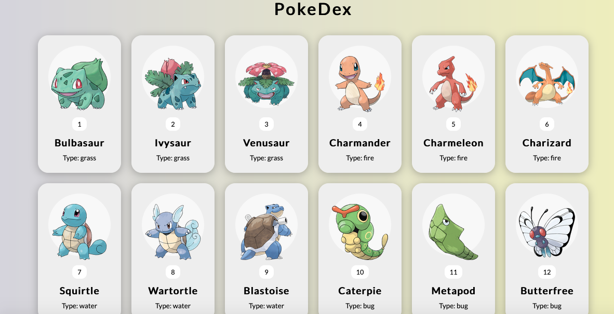

# Pokedex

To better understand and for doing more practices about API I followed tutorial on Youtube:

- [For Pokedex JS Tutorial](https://www.youtube.com/watch?v=XL68br6JyYs)

### Pokedex- JS version:

---

[Click to see](https://ayerdelen.github.io/Pokedex/pokedex-js)

---

### Pokedex - React version: (Upcoming)
